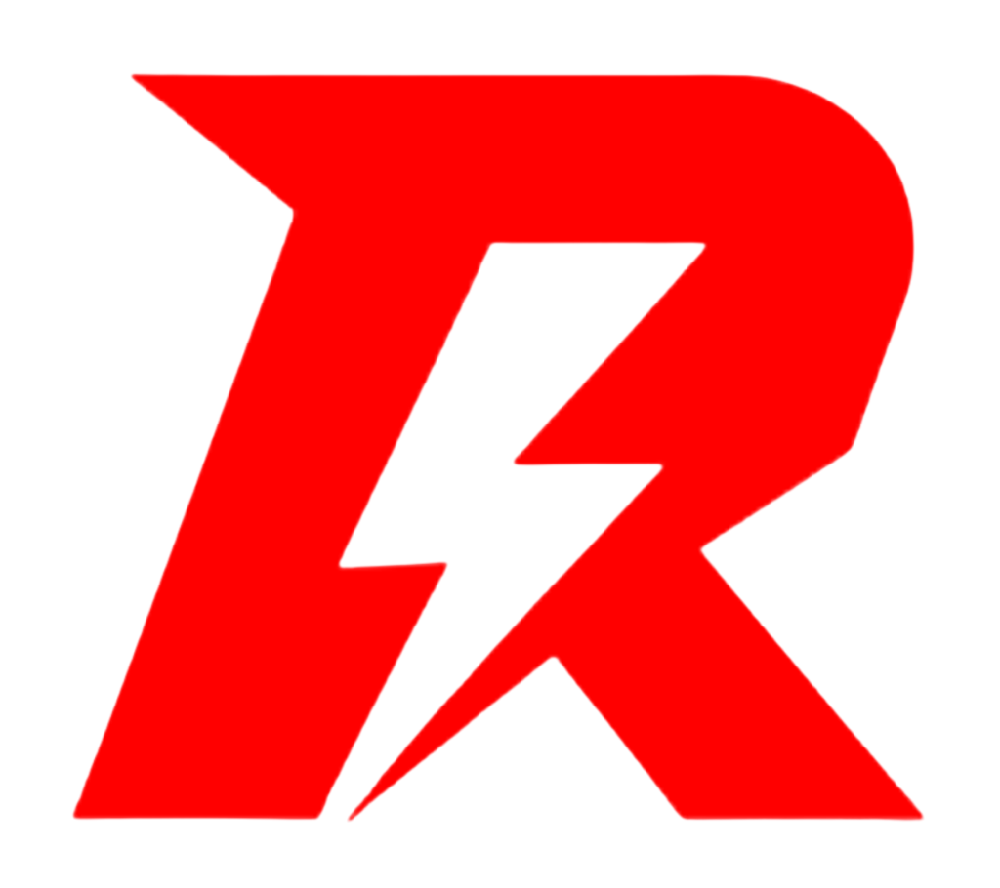

# Recoil Gaming Store 🎯



**Precision Redefined.**

Recoil is a premium e-commerce platform dedicated to high-performance gaming mousepads. Engineered for zero drift and elite competition, our digital storefront matches the quality of our physical products with a high-end, immersive web experience.

## 🚀 Features

### **Visual Experience**
-   **Dynamic Backgrounds**: Custom-engineered grid system with mouse-tracking spotlight / flashlight effects.
-   **Interactive Elements**: "Hidden" brand vocabulary and logos that reveal themselves only when investigated with the cursor.
-   **Aesthetic**: "Zero Drift" design language using strict grid alignments, PlayStation-inspired precision motifs, and a distinct Red/Black/Silver color palette.
-   **Global Immersion**: Consistent atmospheric effects across all pages, including Auth and informational routes.

### **Shop & E-Commerce**
-   **Product Filtering**: Browse by category and granular sub-categories.
-   **Smart Sorting**: Sort products by:
    -   Featured
    -   Price (Low to High / High to Low)
    -   Name (A-Z / Z-A)
-   **Detailed Product Views**: Rich media showcases for every item.

### **Technology**
-   **Next.js 14**: Leveraging the App Router for server-side rendering and speed.
-   **Supabase**: Robust authentication and database management.
-   **Tailwind CSS**: Utility-first styling for pixel-perfect responsive design (up to 4K).
-   **Framer Motion**: Smooth, physics-based animations.

## 🛠️ Stack

-   **Framework:** [Next.js 14](https://nextjs.org/)
-   **Language:** [TypeScript](https://www.typescriptlang.org/)
-   **Styling:** [Tailwind CSS](https://tailwindcss.com/)
-   **Database & Auth:** [Supabase](https://supabase.com/)
-   **Icons:** [Lucide React](https://lucide.dev/)
-   **Deployment:** [Vercel](https://vercel.com/)

## 📦 Getting Started

### Prerequisites
-   Node.js 18+
-   npm or yarn

### Installation
1.  Clone the repository:
    ```bash
    git clone https://github.com/your-username/recoil-gaming-store.git
    cd recoil-gaming-store
    ```

2.  Install dependencies:
    ```bash
    npm install
    # or
    yarn install
    ```

3.  Set up Environment Variables:
    Create a `.env.local` file in the root directory and add your Supabase credentials:
    ```bash
    NEXT_PUBLIC_SUPABASE_URL=your_supabase_url
    NEXT_PUBLIC_SUPABASE_ANON_KEY=your_supabase_anon_key
    ```

4.  Run the development server:
    ```bash
    npm run dev
    ```

Open [http://localhost:3000](http://localhost:3000) with your browser to see the result.

## 🚀 Deployment

This project is optimized for deployment on Vercel.

1.  Push your code to a Git repository (GitHub/GitLab).
2.  Import the project into Vercel.
3.  Add your Environment Variables in the Vercel Dashboard.
4.  Deploy!

Alternatively, deploy via CLI:
```bash
npx vercel --prod
```

## 📄 License

All rights reserved © 2025 Recoil Gaming.
